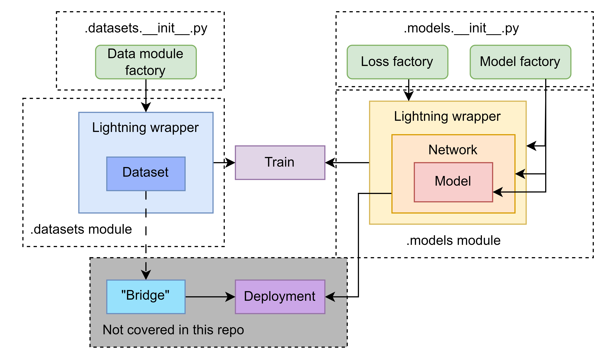

# Semantic segmentation


## Convention

This repo tries to unify a pipeline to train/fine-tune different semantic segmentation models used for other tasks.
The proposed convention is as follows:

<p align="center">
  
</p>

The diagram gives an overall idea about where are the different pieces conceptually and in the module structure. 

- The `model` blocks represent the network architecture (ERFNet, UNet,...). The model might be different for different `networks` (keep reading).
- The `network` includes the `forward` and `get_prediction` methods. Ideally, a `network` object is what you would like to use during `deployment`.
- The `Lightning wrapper` is added for `training` but it is not intended to be used during `deployment`. It adds the functionality for the training lifecycle (train / val / test steps...). It is defined in the same file as the `network`.
- The `dataset` is in charge of loading the training data and also makes use of a Lightning wrapper.
- Some parts not covered by this repo are the deployment code which will be your final application, project or paper code and the corresponding "bridge" for its data source. In some cases, a data loader from the `dataset` module can be used as inspiration to process images or get ground truth data. Check [sensors_tools](https://github.com/dvdmc/sensors_tools/).

## Installation

All the dependencies are listed in the `pyproject.toml` file and you can install it by:

```
python -m pip install -e .
```

It is recommended to use `conda` or a `virtualenv`.

## Usage

You can use the `train` and `test` scripts in the module. They use `tyro` which automatically provides a `cli` interface (try using `train/test --help`). Example configuration files are provided in the `config` folder.

By default, the experiments and `tensorboard` logs are saved in a `experiments` folder.

## Support
Tell people where they can go to for help. It can be any combination of an issue tracker, a chat room, an email address, etc.

## Roadmap
If you have ideas for releases in the future, it is a good idea to list them in the README.

## Contributing
State if you are open to contributions and what your requirements are for accepting them.

For people who want to make changes to your project, it's helpful to have some documentation on how to get started. Perhaps there is a script that they should run or some environment variables that they need to set. Make these steps explicit. These instructions could also be useful to your future self.

You can also document commands to lint the code or run tests. These steps help to ensure high code quality and reduce the likelihood that the changes inadvertently break something. Having instructions for running tests is especially helpful if it requires external setup, such as starting a Selenium server for testing in a browser.

## Authors and acknowledgment

This repository is based on the [bayesian_erfnet]( https://github.com/dmar-bonn/bayesian_erfnet/) repository and discussions with Julius Rückin and Liren Jin.
Specific model atribution are listed here.

- Bayesian ERFNet is based on Jan Weyler's implemention and published in:
 ```
 @article{ruckin2023informativeframework,
  title={{An Informative Path Planning Framework for Active Learning in UAV-based Semantic Mapping}},
  author={R{\"u}ckin, Julius and Magistri, Federico and Stachniss, Cyrill and Popovi{\'c}, Marija},
  journal={arXiv preprint arXiv:2302.03347},
  year={2023},
}
 ```

- Evidential DL losses implementation is taken from [bayesian_erfnet]( https://github.com/dmar-bonn/bayesian_erfnet/), which is a reimplementation of the method published in:
```
@article{sensoy2018evidential,
  title={Evidential deep learning to quantify classification uncertainty},
  author={Sensoy, Murat and Kaplan, Lance and Kandemir, Melih},
  journal={Advances in neural information processing systems},
  volume={31},
  year={2018}
}
```

## License
For open source projects, say how it is licensed.

## Project status
If you have run out of energy or time for your project, put a note at the top of the README saying that development has slowed down or stopped completely. Someone may choose to fork your project or volunteer to step in as a maintainer or owner, allowing your project to keep going. You can also make an explicit request for maintainers.
